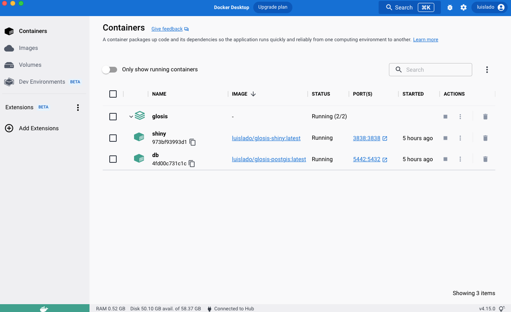
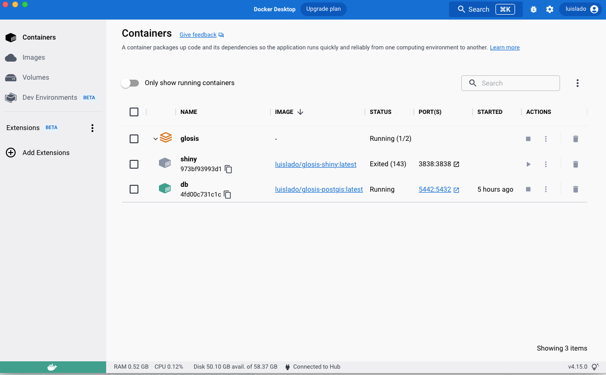
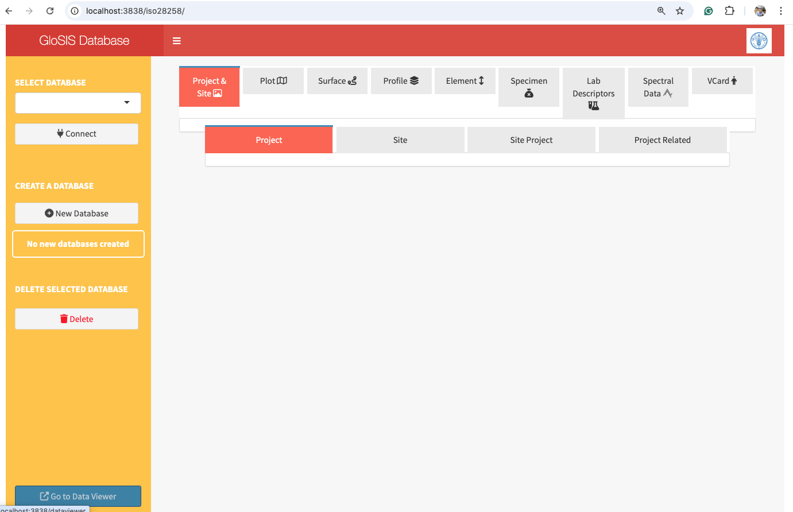

# **Installation and Setup**

This section explains how to set up the necessary environment to run the **GloSIS soil database** injection application, including **Docker**, **PostgreSQL with PostGIS**. The installation process is fully containerized using Docker, which means all dependencies and configurations are pre-defined and work consistently across different systems.

The system consists of two main components: a **PostgreSQL database with PostGIS**, which stores the soil data following the **ISO 28258** standard, and a **Shiny application**, which allows users to inject structured Excel files into the database. These components are deployed together using **Docker Compose**, making the setup process straightforward and ensuring everything runs in a controlled environment.

---

## Installing Docker Desktop

Before proceeding with the installation, Docker Desktop must be installed. Docker is a tool that allows applications to run inside containers, ensuring they work the same way on any system. To install it, go to the official [Docker Desktop website](https://docs.docker.com/desktop/setup/install/windows-install/) and download the version appropriate for your operating system.

After installation, start **Docker Desktop** and verify that it is running by opening a terminal (or command prompt) and running:

```bash
docker --version
```
If the installation was successful, you should see an output displaying the installed version of Docker, such as:

```bash
Docker version 20.10.21, build baeda1f
```
If Docker is running correctly, you are now ready to set up the GloSIS services.

## Setting Up the GloSIS Database and Shiny App
The database and the Shiny app are deployed using Docker Compose, which automates the process of downloading and running multiple containers. Instead of installing PostgreSQL, PostGIS, and the Shiny app separately, all configurations are predefined in a docker-compose.yml file, which allows both services to start together with a single command.

The docker-compose.yml file defines the two services required for this project:

The PostgreSQL database, which includes PostGIS extensions and is configured to store soil data.
The Shiny web application, which provides a graphical interface for injecting data into the database.
Below is the content of docker-compose.yml, which you will use to deploy the system:

```yaml

services:
  postgis:
    image: luislado/glosis-postgis:latest  # Pre-configured PostgreSQL database
    container_name: glosis-db
    restart: always
    environment:
      DB_HOST: postgis
      DB_PORT: 5432
      DB_NAME: postgres
      DB_USER: postgres
      DB_PASSWORD: glosis
      POSTGRES_PASSWORD: glosis
    ports:
      - "5442:5432"  # Makes the database accessible from your machine
    volumes:
      - ./data/postgis:/var/lib/postgresql/data  # Persistent database storage
      - ./init-scripts:/docker-entrypoint-initdb.d  # Schema initialization scripts
    networks:
      - glosis-net

  shinyapp:
    image: luislado/glosis-shiny:latest  # Shiny app for data injection
    container_name: glosis-shiny
    restart: always
    environment:
      USER: shiny
      PASSWORD: shiny
      DB_HOST: postgis
      DB_PORT: 5442
      DB_NAME: postgres
      DB_USER: postgres
      DB_PASSWORD: glosis
    ports:
      - "3838:3838"  # Allows access to the web interface
    volumes:
      - ./init-scripts:/srv/shiny-server/init-scripts  # Shiny app scripts
    depends_on:
      - postgis  # Ensures PostgreSQL starts before the Shiny app
    networks:
      - glosis-net

networks:
  glosis-net:
    driver: bridge
    name: glosis-net
```

This configuration does several things. It creates a network (`glosis-net`) that allows both services to communicate. It ensures that the database (`glosis-db`) is available before starting the Shiny app (`glosis-shiny`). It also maps port 5442 for PostgreSQL, so it can be accessed from outside the container, and port 3838 for the Shiny app, allowing users to interact with it via a web browser.

Additionally, two new folder are created in you installation directory:
1. `/data/postgis` that will store the database outside the `glosis-db` container, and
2. `/init-scripts/` that stores the newest version of the GloSIS database schemas (`.sql`) and additional outputs from running the `glosis-shiny` application.

This ensures that both the database and outputs are stored outside the containers, preventing data loss when the system is restarted.

## Deploying  Services
Once the docker-compose.yml file is in place, you can proceed with launching the system.

First, open a terminal and navigate to the directory where you saved the docker-compose.yml file:

```bash
cd /path/to/docker-compose-directory
```
Then, start the containers by running:

```bash
docker-compose up -d
```
This command will:

1. Download the necessary container images (if they are not already present).
2. Create and run the PostgreSQL database and Shiny app.
3. Ensure that the services run in the background (`-d` flag for "detached mode").

The first time you run this command, the process may take a few minutes as Docker downloads the required images.

To check whether the containers are running correctly, open the Docker Desktop graphical interface (Figure \@ref(fig:docker-desktop)).

```{r docker-desktop, echo=FALSE, out.width="60%",fig.cap = "Docker-desktop graphical interface."}
library(knitr)

```

Note that, in Figure \@ref(fig:docker-desktop), both the project and services icons are in green colour. If some of the services fails from running, either the service icon or the project icon appear in orange color (Figure \@ref(fig:docker-fail)).

```{r docker-fail, echo=FALSE, out.width="60%",fig.cap = "Docker-desktop graphical interface with shiny container not running."}
library(knitr)

```


You can also verify that docker containers are running correctly typing:

```bash
docker ps
```
If everything is working, you should see output similar to the following:

```bash
CONTAINER ID   IMAGE                          STATUS          PORTS
973bf939       luislado/glosis-shiny:latest   Up 2 minutes    0.0.0.0:3838->3838/tcp
4fd00c73       luislado/glosis-postgis:latest Up 2 minutes    0.0.0.0:5442->5432/tcp
```
If at any point you need to stop the services, use:


```bash
docker-compose down
```
This command stops and removes the running containers, but your database data remains intact because it is stored in the `data/postgis` directory.

## Accessing the Services
Once the containers are running, you can access the services as follows:

The PostgreSQL database is available at `localhost:5442`. You can connect to it using tools like `pgAdmin`, `DBeaver`, or directly from `R` using the `DBI package`.

The `glosis-shiny` app can be accessed from your web browser by navigating to:

```bash
http://localhost:3838/
```

This will open the graphical interface where you can upload and inject soil data into PostgreSQL from structured Excel files (Figure \@ref(fig:glosis-shiny)).


```{r glosis-shiny, echo=FALSE, out.width="60%",fig.cap = "Graphical interface for the `glosis-shiny' service."}
library(knitr)

```


