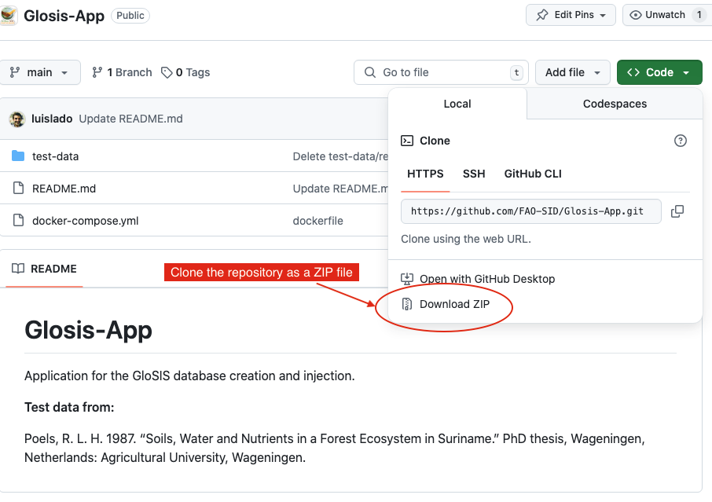

# **Installation and Setup**

The **GloSIS database service** is provided as a **Docker container**, which allows users to deploy and manage the system without manually installing software dependencies. This approach ensures stability, compatibility, and easy updates.  

**Docker Compose** is a tool used to define and run multi-container Docker applications. It allows users to **orchestrate multiple services** using a single configuration file ( see Section **The docker-compose.yml file**). The key benefits of Docker Compose include:

-  **Simplified Deployment** – Automatically pulls and runs multiple containers with a single command.  
-  **Predefined Configuration** – Ensures all services are correctly configured and work together.  
-  **Portability** – The same configuration can be used across different systems without installation issues.  

The system consists of two main **services**, both running as Docker containers:  

1. **`glosis-db`** – A **GloSIS harmonized PostgreSQL database** that stores soil data following the **ISO 28258** standard.  
2. **`glosis-shiny`** – A **Shiny web application** providing a graphical interface to inject structured Excel files into the database.  

These services are **built from pre-configured Docker images** and automatically deployed as containers using **Docker Compose**, meaning all dependencies are pre-configured, ensuring a consistent and reproducible execution across different operating systems.  

This section provides step-by-step instructions to set up the **GloSIS soil database**, including the installation of **Docker Desktop**, **PostgreSQL**, and **R**. The setup process is **containerized using Docker**, 


## Install Docker Desktop

Before proceeding, **Docker Desktop** must be installed in your computer.

### Windows

1. Enable **Hyper-V**
Docker Desktop requires Hyper-V as well as the Hyper-V Module for Windows PowerShell to be installed and enabled. In most systems, the Docker Desktop installer enables it for you.

  To test if Hyper-V is enabled, go to the start menu and type:
  
  ```bash
  Turn Windows features on or off
  ```
  and press enter. In the subsequent screen, verify that Hyper-V is enabled.
  
  To install Hyper-V manually, see [Install Hyper-V on Windows 10](https://learn.microsoft.com/es-es/windows-server/virtualization/hyper-v/get-started/Install-Hyper-V?pivots=windows-server). A reboot is required after installation. If you install Hyper-V without rebooting, Docker Desktop does not work correctly.
  
  In some Windows systems [Virtualization](https://support.microsoft.com/en-gb/windows/enable-virtualization-on-windows-c5578302-6e43-4b4b-a449-8ced115f58e1) must be enabled in the BIOS. Note that many Windows devices already have virtualization enabled, so this may not apply.

2. Download **Docker Desktop for Windows** from the [official website](https://docs.docker.com/desktop/install/windows-install/).
3. Run the installer and follow the on-screen instructions.
4. After installation, restart your computer.
5. Open **Docker Desktop** and ensure it is running.

### MacOS
1. Download **Docker Desktop for Mac** from the [official website](https://docs.docker.com/desktop/install/mac-install/).
2. Open the `.dmg` file and drag **Docker** into the Applications folder.
3. Start **Docker Desktop** and allow any requested system permissions.

### Linux
1. Open a terminal and run the following commands:
   
```bash
   sudo apt update
   sudo apt install docker.io -y
   sudo systemctl start docker
   sudo systemctl enable docker
```
Add your user to the Docker group (to run Docker without sudo):

```bash
sudo usermod -aG docker $USER
```


Restart your computer and verify Docker is running:

```bash
docker --version
```
If the installation was successful, you should see output similar to:

```bash
Docker version 24.0.5, build 123456
```


## Install the GloSIS database services
The easiest way to install the GloSIS database services is by pulling pre-built Docker images available in the GloSIS docker hub.

### Steps

1. Ensure Docker Desktop is running.

2. Download the [GloSIS repository from GitHub](https://github.com/FAO-SID/Glosis-App):

3. Go to:

```bash
`https://github.com/FAO-SID/Glosis-App`.
```

4. Click the green `"Code"` button, then select Download ZIP (Figure \@ref(fig:clone).  

```{r clone, echo=FALSE, out.width="60%",fig.cap = "Clonning the repository."}

```


5. Extract the *ZIP* file to a folder on your computer (e.g. in the `Desktop` folder).

6. Open a Terminal or Command Prompt, navigate to the extracted folder:

```bash
cd Desktop/Glosis-App
```
7. Start the GloSIS services by running:

```bash
docker-compose up -d
```

The first time you run this command, it may take a few minutes to download all required images.


### Verify Installation

- Using Docker Desktop
Open Docker Desktop and check if the containers are running (Figure \@ref(fig:docker-desktop)).

```{r docker-desktop, echo=FALSE, out.width="60%",fig.cap = "Docker desktop."}
knitr::include_graphics("figures/docker_desktop.png")
```

If everything is working, the project and service icons should be green.
If any service fails, the icon will appear orange (Figure \@ref(fig:docker-fail)).

```{r docker-fail, echo=FALSE, out.width="60%",fig.cap = "Failure on some docker desktop service."}
library(knitr)
knitr::include_graphics("figures/docker_fail.png")
```

- Using the Terminal
To manually check if the services are running, type:

```bash
docker ps
```
You should see an output similar to:

```bash
CONTAINER ID   IMAGE                          STATUS          PORTS
973bf939       luislado/glosis-shiny:latest   Up 2 minutes    0.0.0.0:3838->3838/tcp
4fd00c73       luislado/glosis-postgis:latest Up 2 minutes    0.0.0.0:5442->5432/tcp
```
To stop the services at any time, use: 

```bash
docker-compose down
```
This will stop and remove the containers, but your database data will remain intact in the data/postgis directory.


## Accessing the Services

**Shiny Web Application:**
To open the `GloSIS Shiny` App, enter this address in your web browser:

```bash
http://localhost:3838/
```

This will load the interface where you can upload and inject soil data from .xlsx files (Figure \@ref(fig:glosis-shiny)).

```{r glosis-shiny, echo=FALSE, out.width="40%",fig.cap = "GloSIS shiny application."}
knitr::include_graphics("figures/glosis_shiny.png")
```

**GloSIS database:**
The PostgreSQL GloSIS database is available to connect with other applications such as pgAdmin, DBeaver,QGIS, R, etc, at:

```bash
localhost:5442
```
The user and password for the connection is 'glosis' by default.

## The docker-compose.yml File

The `docker-compose.yml` file defines how the **GloSIS database service** and **Shiny web application** interact within a **Docker environment**. This configuration file ensures that both components are deployed together with the correct settings, storage locations, and networking.

This file creates **two containers**:

- **`glosis-db`**: A PostgreSQL database with **PostGIS** extensions for handling spatial data. This database stores all soil data in accordance with the **ISO 28258** standard.
- **`glosis-shiny`**: A **Shiny web application** that provides a graphical interface for users to inject structured Excel files into the database.

To ensure **persistent data storage**, the database files are stored outside the containers in the `data/postgis` directory. This means that even if the containers are stopped or removed, the database remains intact.

### Networking and Port Configuration

A dedicated **Docker network (`glosis-net`)** is created to allow seamless internal communication between the **database** and the **Shiny application**. This ensures the services can interact without interference from other network traffic on the host system.

For PostgreSQL, **port 5442** is used instead of the default **5432**. This prevents potential conflicts with any existing PostgreSQL installation on the host machine. When the container is launched, PostgreSQL inside the container still listens on **5432**, but it is mapped externally to **5442** to avoid interference with other PostgreSQL instances that may already be running.

The **Shiny application** is made accessible through **port 3838**, which remains unchanged from the standard port used by Shiny.

### Structure of the docker-compose.yml file 

The following `docker-compose.yml` configuration defines these services:

```yaml
services:
  postgis:
    image: luislado/glosis-postgis:latest  # Pre-configured PostgreSQL database with PostGIS
    container_name: glosis-db
    restart: always
    environment:
      DB_HOST: postgis
      DB_PORT: 5432
      DB_NAME: postgres
      DB_USER: postgres
      DB_PASSWORD: glosis
      POSTGRES_PASSWORD: glosis
    ports:
      - "5442:5432"  # Maps internal PostgreSQL port 5432 to external port 5442 to avoid conflicts
    volumes:
      - ./data/postgis:/var/lib/postgresql/data  # Stores database files persistently
      - ./init-scripts:/docker-entrypoint-initdb.d  # Includes schema initialization scripts
    networks:
      - glosis-net

  shinyapp:
    image: luislado/glosis-shiny:latest  # Shiny app for data injection
    container_name: glosis-shiny
    restart: always
    environment:
      DB_HOST: postgis
      DB_PORT: 5442  # Uses the externally mapped port to connect to PostgreSQL
      DB_NAME: postgres
      DB_USER: postgres
      DB_PASSWORD: glosis
    ports:
      - "3838:3838"  # Exposes the Shiny application on port 3838
    volumes:
      - ./init-scripts:/srv/shiny-server/init-scripts  # Stores scripts and outputs
    depends_on:
      - postgis  # Ensures the database is running before starting the Shiny app
    networks:
      - glosis-net

networks:
  glosis-net:
    driver: bridge
```

This configuration ensures that:

- The **database container** (`glosis-db`) starts first and runs independently.

- The **Shiny application** (`glosis-shiny`) waits for the database before launching.

- **Data is stored outside the containers** to prevent loss in case the containers are restarted or deleted.

- **Port conflicts** are avoided by mapping PostgreSQL’s internal port 5432 to 5442 on the host machine.

With this setup, users can easily run and manage the GloSIS database service and its Shiny web interface while ensuring stability and avoiding conflicts with other PostgreSQL installations.


