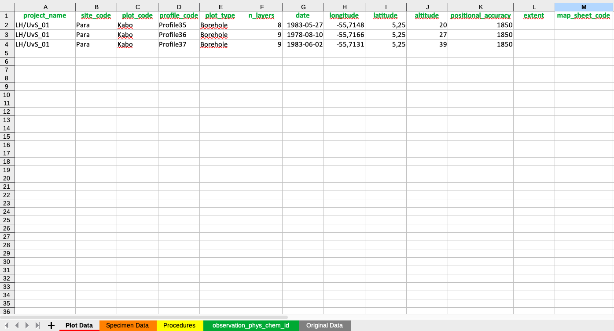
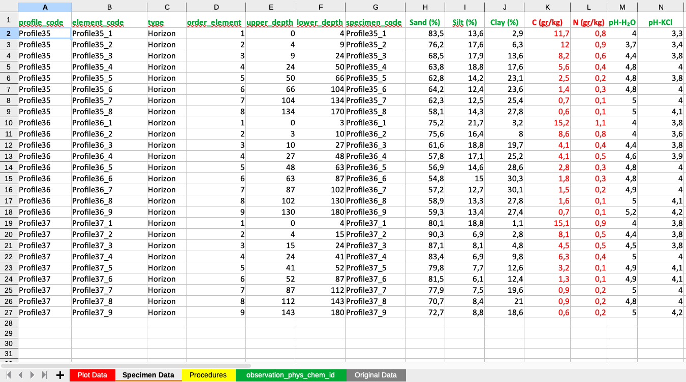
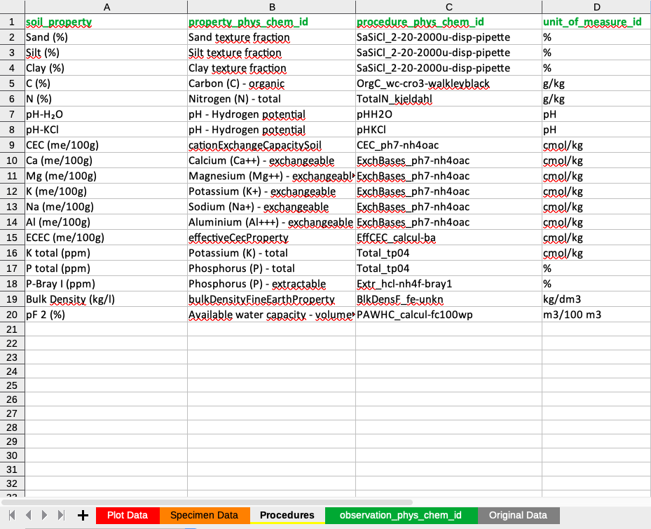
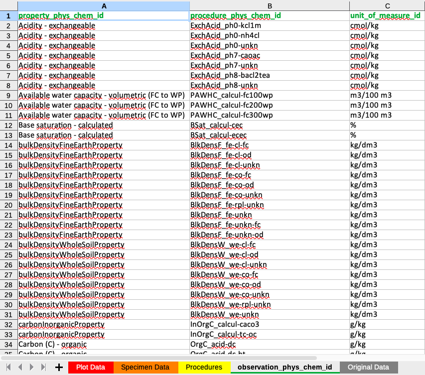

# **Data preparation**

The GloSIS database is structured as a complex relational PostgreSQL database. Its intricate design can pose challenges for users who are not familiar with SQL or PostgreSQL programming, making it difficult to directly translate soil data into this format.

The primary objective of the `glosis-shiny` application is to facilitate the conversion of soil data from an easy to read and compile format, into a standardized PostgreSQL database format for integration with the GloSIS platform. By automating and harmonizing the data injection into the PostgreSQL database, the application significantly streamlines the workflow, making it more accessible for users without advanced technical expertise. This step is crucial in building the GloSIS infrastructure, as it ensures that soil data from different sources can be shared and compared effectively.

The data injection is performed thought a standardized Excel (`.xlsx`) template that serves as an intermediary format for structuring soil data before its integration into the PostgreSQL database. This template ensures that the data follows a predefined schema, aligning with the complex relational structure of the GloSIS database. The template consists of multiple sheets, each corresponding to a specific data entity, such as site information, soil horizons/layers, laboratory procedures, and analytical results structured in different sheets. Each column in these sheets is carefully labeled to match the expected database fields, reducing errors and ensuring data consistency. Users are required to fill in the template while adhering to specific data formats, such as numeric values for measurements, categorical values for predefined classifications, and geospatial coordinates in standard longitude and latitude formats. The structured nature of the template minimizes manual intervention and ensures that data is correctly mapped when it is processed by the `glosis-shiny` application. The application validates the input, identifies potential discrepancies, and harmonizes the dataset before transferring it into PostgreSQL, ultimately simplifying the data submission process while maintaining accuracy and comparability.

The data in the standardized Excel template must be collected in a harmonized manner to ensure consistency and accuracy during integration into the GloSIS database. This requires harmonization of spatial coordinates to the EPSG:4326 coordinate system recorded in the `Plot_Data` sheet, ensuring homogeneous sample georeferencing. Additionally, the identification of standard soil property names, laboratory methods, and units of measurement must be correctly defined in the `Procedures` sheet. If the original data is recorded in different units, it must be converted to match the standardized units specified in the `Procedures` sheet before inclusion in the `Specimen_Data` sheet.

Furthermore, all soil properties listed in the `Specimen Data` and `Procedures` sheets must correspond to those available in the `Codelist` sheet, which contains the standardized soil properties defined in the GloSIS **`codelist`**. Any property not included in the `Codelist` sheet must be removed from the template before data injection to ensure compatibility with the GloSIS database. This harmonization process is essential for maintaining data consistency, facilitating data sharing, and ensuring seamless integration with the global soil information system.

## Understanding the XLSX Template

The Excel file consists of multiple sheets that include the corresponding information to populate the different PostgreSQL GloSIS database tables:

1.  **Plot Data**: The `Plot Data` sheet contains essential information for describing the sampling locations and associated metadata.

2.  **Specimen Data**: This sheet contains soil information at the sample level, including laboratory analyses.

3.  **Procedures**: This sheet establishes the connection between measured soil properties, standardized soil property names, laboratory methods, and units of measurement, ensures consistency and interoperability between different soil datasets.

4.  **Codelist**: This sheet shows a compilation of all the standardized soil property names, laboratory methods, and units of measurement according to the GloSIS `codelist` for soil properties)

5.  **Original Data**: This sheet is optional but serves as a record of the original sampling values for soil descriptions and analytical properties..

The template acts as a graphical interface where you can register your soil data.

In the following sections, we provide a detailed overview of each of these sheets.

## Plot Data Sheet

The `Plot Data` sheet (Figure \@ref(fig:plot-tab)) provides information about the sampling site. It included the identification of the project in which the sample was collected (`project_code`), the identifiers for the sampling site (`site_code`), plot (`plot_code`) and the profile (`profile_code`). The `plot_type` column describes whether the sample has been collected using an auger (`Borehole`) of comes from an open profile (`Pit`).

The `n_layers` column indicates the number of samples collected at different depths for a given site. This information is essential for populating the Specimen_Data sheet when using the script provided in this manual (Annex 1). The number of samples corresponds to the number of horizons or layers collected at each sampling point. For example, if a soil profile consists of three horizons and all horizons have been sampled, the `n_layers` value will be 3.

`Date` registers the date when the survey was conducted. The date format for this column **must** be "YYYY-MM-DD".

The next columns refer to the georeference of the sample including `latitude`, `longitude`, and `altitude`, along with details on positional accuracy (`positional_accuracy`), spatial extent (`extent`), and the corresponding map sheet reference (`map_sheet_code`). The spatial coordinates `latitude` and `longitude` **must** be in geographic decimal degrees using the **EPSG:4326** coordinate system.

```{r plot-tab, echo=FALSE, out.width="60%",fig.cap = "Information in the Plot_Data Tab."}

```

## Specimen Data Sheet

The `Specimen Data` sheet (Figure \@ref(fig:specimen-tab)) contains detailed soil information at the sample level, including data from each individual horizon or layer, their boundaries, and associated soil properties derived from laboratory analyses.

For each sampled horizon or layer, the sheet includes unique identifiers for the profile, element, and specimen (`profile_code`,`element_code`,`specimen_code`). These identifiers should follow a structured naming convention, typically consisting of the soil profile name followed by a numeric sequence corresponding to the sampled horizon or layer. However, they can be freely named as long as they remain unique. The sheet also specifies the type of observation (`Layer`or `Horizon`), as well as the upper and lower depth boundaries (`upper_depth`, `lower_depth`). A `Horizon` refers to a genetically classified horizon in the soil profile, while a `Layer` represents a soil sample collected based on alternative criteria, such as a fixed depth interval rather than pedogenetic origin.

Additionally, the sheet records the corresponding physical and chemical values of soil properties obtained from laboratory analyses, including pH, Soil Organic Carbon, clay content, and other relevant properties.

```{r specimen-tab, echo=FALSE, out.width="60%",fig.cap = "Information in the Specimen Data sheet."}

```

As an illustration, the columns with red values in Figure \@ref(fig:specimen-tab) indicate soil parameters that required unit conversions to align with GloSIS standard units of measurement, compared to their original values.


## Procedures Sheet

The `Procedures` sheet (Figure \@ref(fig:procedures-tab)) establishes the connection between measured soil properties, standardized soil property names, laboratory methods, and units of measurement. It links the measured soil property names with their corresponding standardized identifiers (`property_phys_chem_id`) and incorporates information about the associated laboratory procedure identifier (`procedure_phys_chem_id`) and the standard unit of measurement (`unit_of_measure_id`) in the GloSIS standard `Codelist`sheet. The first column must contain the names of the measured soil properties for each sample, and must follow the sequence of soil properties included in the `Specimen Data`. The second, third, and fourth columns provide information on the standardized property names, laboratory methods, and units of measurement, respectively. The `Procedures` sheet facilitates accurate comparisons across datasets, allowing users to trace how each soil property was measured and in which units the results are reported. If soil measurements were recorded in units different from the standard, they must be converted to the harmonized units of measurement before entering the data in the `Specimen Data` sheet. This structured approach enhances data harmonization within the GloSIS framework.

```{r procedures-tab, echo=FALSE, out.width="40%",fig.cap = "Information in the Procedures sheet."}

```

## Codelist Sheet

The `Codelist` sheet (Figure \@ref(fig:codelist-tab)) contains a comprehensive list of standardized soil property names (`property_phys_chem_id`), laboratory methods (`procedure_phys_chem_id`), and units of measurement (`unit_of_measure_id`), as defined in the current GloSIS codelist for soil properties. This standardized framework ensures uniformity in data representation and provides the foundation for accurately populating the `Procedures` sheet. Only soil properties listed in the `Codelist` sheet can be incorporated into the PostgreSQL GloSIS Database. Any measured soil property, method or unit that is not present in this standardized list cannot be uploaded and must be removed from both the `Specimen Data` and `Procedures` sheets before data injection. This requirement ensures the harmonization of soil datasets and maintains data interoperability within the GloSIS framework.

However, the codelist is continuously updated to incorporate new soil analytical properties, laboratory methods, and measurement units, enhancing the system's capacity for integrating diverse soil datasets.

```{r codelist-tab, echo=FALSE, out.width="40%",fig.cap = "Properties, methods and units of measurement in the Codelist sheet"}

```

## Original Data Sheet

The `Original Data` sheet stores all raw data from soil analyses and descriptions. While optional, it is recommended for maintaining a record of original values, particularly when unit conversions or transformations are required. This sheet helps ensure data traceability and good documentation practices. Values in the `Original Data` sheet can be linked via formulas to the `Specimen Data` sheet, allowing for automated transformation and integration of adjusted values in this latter sheet while preserving the original records.


Ensuring the correct utilization of the template is essential for the successful execution of the data injection process. Proper adherence to the template structure guarantees data integrity, compatibility, and seamless integration into the PostgreSQL GloSIS Database.

