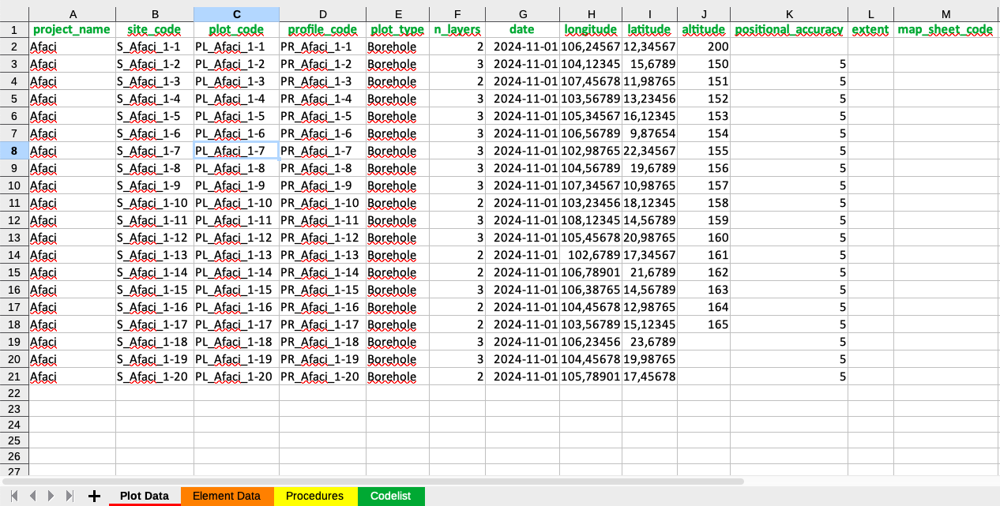
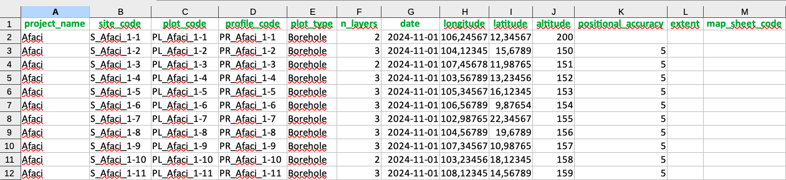
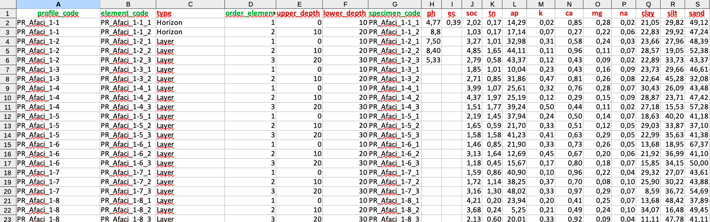
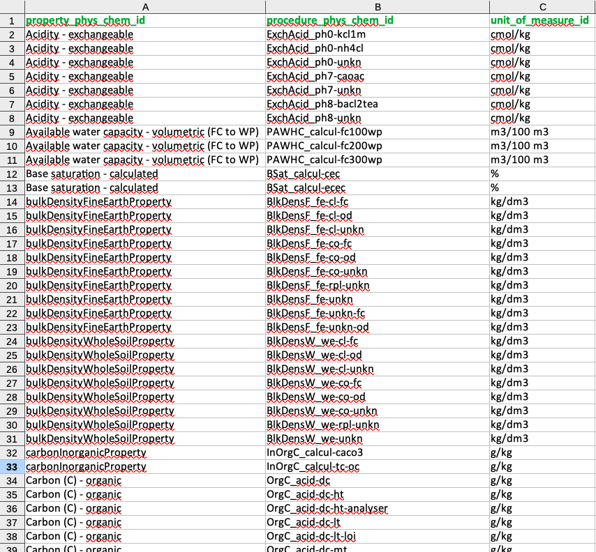

# **Data preparation**

The GloSIS database is structured as a complex relational PostgreSQL database. Its intricate design can pose challenges for users who are not familiar with SQL or PostgreSQL programming, making it difficult to directly translate soil data into this format.

The primary objective of the `glosis-shiny` application is to facilitate the conversion of soil data from an easy to read and compile format, into a standardized PostgreSQL database format for integration with the GloSIS platform. By automating and harmonizing the data injection into the PostgreSQL database, the application significantly streamlines the workflow, making it more accessible for users without advanced technical expertise. This step is crucial in building the GloSIS infrastructure, as it ensures that soil data from different sources can be shared and compared effectively.

The data injection is performed thought a standardized Excel (`.xlsx`) template that serves as an intermediary format for structuring soil data before its integration into the PostgreSQL database. This template ensures that the data follows a predefined schema, aligning with the complex relational structure of the GloSIS database. The template consists of multiple sheets, each corresponding to a specific data entity, such as site information, soil horizons/layers, laboratory procedures, and analytical results structured in different sheets. Each column in these sheets is carefully labeled to match the expected database fields, reducing errors and ensuring data consistency. Users are required to fill in the template while adhering to specific data formats, such as numeric values for measurements, categorical values for predefined classifications, and geospatial coordinates in standard longitude and latitude formats. The structured nature of the template minimizes manual intervention and ensures that data is correctly mapped when it is processed by the `glosis-shiny` application. The application validates the input, identifies potential discrepancies, and harmonizes the dataset before transferring it into PostgreSQL, ultimately simplifying the data submission process while maintaining accuracy and comparability.

The data in the standardized Excel template must be collected in a harmonized manner to ensure consistency and accuracy during integration into the GloSIS database. This requires harmonization of spatial coordinates to the EPSG:4326 coordinate system recorded in the `Plot_Data` sheet, ensuring homogeneous sample georeferencing. Additionally, the identification of standard soil property names, laboratory methods, and units of measurement must be correctly defined in the `Procedures` sheet. If the original data is recorded in different units, it must be converted to match the standardized units specified in the `Procedures` sheet before inclusion in the `Specimen_Data` sheet.

Furthermore, all soil properties listed in the `Specimen Data` and `Procedures` sheets must correspond to those available in the `Codelist` sheet, which contains the standardized soil properties defined in the GloSIS **`codelist`**. Any property not included in the `Codelist` sheet must be removed from the template before data injection to ensure compatibility with the GloSIS database. This harmonization process is essential for maintaining data consistency, facilitating data sharing, and ensuring seamless integration with the global soil information system.

## Understanding the XLSX Template

The Excel file consists of multiple sheets that include the corresponding information to populate the different PostgreSQL GloSIS database tables:

1.  **Plot Data**: The `Plot Data` sheet contains essential information for describing the sampling locations and associated metadata.

2.  **Specimen Data**: This sheet contains soil information at the sample level, including laboratory analyses.

3.  **Procedures**: This sheet establishes the connection between measured soil properties, standardized soil property names, laboratory methods, and units of measurement, ensures consistency and interoperability between different soil datasets.

4.  **Codelist**: This sheet shows a compilation of all the standardized soil property names, laboratory methods, and units of measurement according to the GloSIS `codelist` for soil properties)

The template (Figure \@ref(fig:template)) acts as a graphical interface where you can register your soil data.

```{r template, echo=FALSE, out.width="60%",fig.cap = "xlsx template."}
library(knitr)

```

In the following sections, we provide a detailed overview of each of these sheets.

## Plot Data Sheet

The `Plot Data` sheet (Figure \@ref(fig:plot-tab)) provides information about the sampling site. It included the identification of the project in which the sample was collected (`project_code`), the identifiers for the sampling site (`site_code`), plot (`plot_code`) and the profile (`profile_code`). The `plot_type` column describes whether the sample has been collected using an auger (`Borehole`) of comes from an open profile (`Pit`).

The `n_layers` column indicates the number of samples collected at different depths for a given site. This information is essential for populating the Specimen_Data sheet when using the script provided in this manual (Annex 1). The number of samples corresponds to the number of horizons or layers collected at each sampling point. For example, if a soil profile consists of three horizons and all horizons have been sampled, the `n_layers` value will be 3.

`Date` registers the date when the survey was conducted. The date format for this column **must** be "YYYY-MM-DD".

The next columns refer to the georeference of the sample including `latitude`, `longitude`, and `altitude`, along with details on positional accuracy (`positional_accuracy`), spatial extent (`extent`), and the corresponding map sheet reference (`map_sheet_code`). The spatial coordinates `latitude` and `longitude` **must** be in geographic decimal degrees using the **EPSG:4326** coordinate system.

```{r plot-tab, echo=FALSE, out.width="60%",fig.cap = "Information in the Plot_Data Tab."}

```

## Specimen Data Sheet

The `Specimen Data` sheet (Figure \@ref(fig:specimen-tab)) contains detailed soil information at the sample level, including data from each individual horizon or layer, their boundaries, and associated soil properties derived from laboratory analyses.

For each sampled horizon or layer, the sheet includes unique identifiers for the profile, element, and specimen (`profile_code`,`element_code`,`specimen_code`). These identifiers should follow a structured naming convention, typically consisting of the soil profile name followed by a numeric sequence corresponding to the sampled horizon or layer. However, they can be freely named as long as they remain unique. The sheet also specifies the type of observation (`Layer`or `Horizon`), as well as the upper and lower depth boundaries (`upper_depth`, `lower_depth`). A `Horizon` refers to a genetically classified horizon in the soil profile, while a `Layer` represents a soil sample collected based on alternative criteria, such as a fixed depth interval rather than pedogenetic origin.

Additionally, the sheet records the corresponding physical and chemical values of soil properties obtained from laboratory analyses, including pH, Soil Organic Carbon, clay content, and other relevant properties.

```{r specimen-tab, echo=FALSE, out.width="60%",fig.cap = "Information in the Specimen Data sheet."}

```

## Procedures Sheet

The `Procedures` sheet (Figure \@ref(fig:procedures-tab)) establishes the connection between measured soil properties, standardized soil property names, laboratory methods, and units of measurement. It links the measured soil property names with their corresponding standardized identifiers (`property_phys_chem_id`) and incorporates information about the associated laboratory procedure identifier (`procedure_phys_chem_id`) and the standard unit of measurement (`unit_of_measure_id`) in the GloSIS standard `Codelist`sheet. The first column must contain the names of the measured soil properties for each sample, and must follow the sequence of soil properties included in the `Specimen Data`. The second, third, and fourth columns provide information on the standardized property names, laboratory methods, and units of measurement, respectively. The `Procedures` sheet facilitates accurate comparisons across datasets, allowing users to trace how each soil property was measured and in which units the results are reported. If soil measurements were recorded in units different from the standard, they must be converted to the harmonized units of measurement before entering the data in the `Specimen Data` sheet. This structured approach enhances data harmonization within the GloSIS framework.

```{r procedures-tab, echo=FALSE, out.width="60%",fig.cap = "Information in the Procedures sheet."}
knitr::include_graphics("figures/procedures_tab.png")
```

## Codelist Sheet

The `Codelist` sheet (Figure \@ref(fig:codelist-tab)) contains a comprehensive list of standardized soil property names (`property_phys_chem_id`), laboratory methods (`procedure_phys_chem_id`), and units of measurement (`unit_of_measure_id`), as defined in the current GloSIS codelist for soil properties. This standardized framework ensures uniformity in data representation and provides the foundation for accurately populating the `Procedures` sheet. Only soil properties listed in the `Codelist` sheet can be incorporated into the PostgreSQL GloSIS Database. Any measured soil property, method or unit that is not present in this standardized list cannot be uploaded and must be removed from both the `Specimen Data` and `Procedures` sheets before data injection. This requirement ensures the harmonization of soil datasets and maintains data interoperability within the GloSIS framework.

However, the codelist is continuously updated to incorporate new soil analytical properties, laboratory methods, and measurement units, enhancing the system's capacity for integrating diverse soil datasets.

```{r codelist-tab, echo=FALSE, out.width="60%",fig.cap = "Properties, methods and units of measurement in the Codelist sheet"}

```

Ensuring the correct utilization of the template is essential for the successful execution of the data injection process. Proper adherence to the template structure guarantees data integrity, compatibility, and seamless integration into the PostgreSQL GloSIS Database.

## Exercise on data preparation

The example presented in this section uses data from three soil profiles from undisturbed forests in Suriname [@poels1987] collected with a soil auger: one Orthic Ferralsol (*Profile 35*, 8 horizons) and two Xanthic Ferralsols (*Profiles 36 and 37*, 9 horizons each). This data requires harmonization in coordinate systems, dates, soil properties, and laboratory methods before being included in the GloSIS database. For simplification, only analytical data for selected soil parameters have been included in this exercise.

### Filling out the plot data sheet

All soil profiles have been collected within the same project. The `project_name` column for all profiles is set to `LH/UvS_01`.

The `profile_code` attribute follows the names of the soil profiles in the original document.

`site_code` and `plot_code` inform about the location of the sample. In this case `site_code` has been set to the district (`Para`) and `site_code` to the protected area of `Kabo`, where all samples were collected.

Since the samples were collected with an auger, the `plot_type` attribute must be set to `borehole` The available options are `borehole` for auger sampling and `pit` if an open pit was excavated.

For each soil sampling point, the `n_layers` attribute correspond to the number of horizons/layers collected at that point. In this case, `n_layers` is equal to the number of horizons sampled by profile.

The `date` format in the original document follows the `*DD Month YYYY*` format (e.g., 27 May 1983). This format must be converted to `*YYYY-MM-DD*` (1983-05-27), which is the standard format accepted by the GloSIS database.

The original coordinates of the points were expressed in **degrees and minutes**, using a central point as a reference (5°15'N, 55°43'W) and including displacement information in meters. Additionally, the coordinate system (**EPSG**) was not defined. We estimated the coordinates for each soil sampling point, using the information provided, in relation to the **EPSG::4326** coordinate system (see Table \@ref(tab:soil-coordinates)).

No corrections were necessary for `altitude`. The `positional accuracy` was estimated at *1850 m*.   <br><br>


```{r soil-coordinates, echo=FALSE}
# Create a data frame for the table
soil_profiles <- data.frame(
  project_name = c("LH/UvS_01", "LH/UvS_01", "LH/UvS_01"),
  site_code = c("Para", "Para", "Para"),
  plot_code = c("Kabo", "Kabo", "Kabo"),
  profile_code = c("Profile35", "Profile36", "Profile37"),
  plot_type = c("Borehole", "Borehole", "Borehole"),
  n_layers = c(8,9,9),
  date = c("1983-05-27", "1978-08-10", "1983-06-02"),
  longitude = c(-55.7148, -55.7166, -55.7131),
  latitude = c(5.25, 5.25, 5.25),
  altitude = c(20, 27, 39),
  positional_accuracy = c(1850, 1850, 1850),
  extent = c("","",""),
  map_sheet_code = c("", "", "")
)

# Print the table in a nicely formatted way
kable(soil_profiles, caption = "Table 1: Harmonized data for the plot data sheet.")
```

<br>
The `extent` column refers to a surface plot. In this example, the samples are points, so no information on extent is applicable.

The columns `altitude`, `positional accuracy` and `map_sheet_code` are optional.


### Filling out the specimen data sheet

The `specimen data` sheet contains information for each soil sample collected at each soil sampling location. The number of rows must therefore be equal to the total number of horizons/layers at each sampling location (`n_layers`). In this example, the total number of rows in this sheet is 26.

Two different types of data are required in this sheet. First, the columns `profile_code`, `element_code`, `type`, `order_element`, `upper_depth`, `lower_depth`, and `specimen_code` serve as identifiers for samples, sample types, and soil depths. The remaining columns correspond to soil properties measured through laboratory analyses.

The `profile_code` column references the same attribute from the previous sheet and must contain repetitions corresponding to the number of horizons collected at each sampling location.

The `order_element` column is a sequential number that increases from top to bottom horizons, starting from 1.

The `element_code` is generated by combining the `profile_code` and `order_element` to create a unique identifier for each horizon.

The `type` attribute is set to `Horizon` for genetic soil horizons. If the sample is not collected based on pedogenetic criteria but is defined by specific boundaries, the option `Layer` is used.

The `upper_depth` and `lower_depth` columns specify the depth range (in cm) of each horizon or layer within the soil profile. Except for the top horizon, the `upper_depth` value of each horizon must match the `lower_depth` value of the preceding horizon within the same profile.

The `specimen_code` is an alphanumeric string that uniquely identifies each soil sample. In this case, the same value as `element_code` has been used for consistency.   <br><br>


```{r plotparameters1, echo=FALSE}

# Create a data frame for the table
soil_horizons <- data.frame(
  profile_code = c(rep("Profile35", 8), rep("Profile36", 9), rep("Profile37", 9)),
  element_code = c(
    "Profile35_1", "Profile35_2", "Profile35_3", "Profile35_4", "Profile35_5", "Profile35_6", "Profile35_7", "Profile35_8",
    "Profile36_1", "Profile36_2", "Profile36_3", "Profile36_4", "Profile36_5", "Profile36_6", "Profile36_7", "Profile36_8", "Profile36_9",
    "Profile37_1", "Profile37_2", "Profile37_3", "Profile37_4", "Profile37_5", "Profile37_6", "Profile37_7", "Profile37_8", "Profile37_9"
  ),
  type = rep("Horizon", 26),
  order_element = c(1:8, 1:9, 1:9),
  upper_depth = c(0, 4, 9, 24, 50, 66, 104, 134, 0, 3, 10, 27, 48, 63, 87, 102, 130, 0, 4, 15, 24, 41, 52, 87, 112, 143),
  lower_depth = c(4, 9, 24, 50, 66, 104, 134, 170, 3, 10, 27, 48, 63, 87, 102, 130, 180, 4, 15, 24, 41, 52, 87, 112, 143, 180),
  specimen_code = c(
    "Profile35_1", "Profile35_2", "Profile35_3", "Profile35_4", "Profile35_5", "Profile35_6", "Profile35_7", "Profile35_8",
    "Profile36_1", "Profile36_2", "Profile36_3", "Profile36_4", "Profile36_5", "Profile36_6", "Profile36_7", "Profile36_8", "Profile36_9",
    "Profile37_1", "Profile37_2", "Profile37_3", "Profile37_4", "Profile37_5", "Profile37_6", "Profile37_7", "Profile37_8", "Profile37_9"
  )
)

# Print the table in a nicely formatted way
kable(soil_horizons, caption = "Sample descriptors in the specimen data sheet")
```

<br>
The parameters for soil properties must include, for each property, its measured value in the laboratory using the harmonized units of measurement defined in GloSIS, as specified in the `observation_phys_chem_id` column of the template. Any value reported in different units **MUST** be converted to the harmonized units before being entered into this sheet. Values that fall outside the predefined lower and upper thresholds in the database will be excluded, preventing full population of the database.


### Filling out the procedures data sheet

The first column in the `Procedures` sheet **MUST** contain all soil analytical properties included in the `specimen data` and in the same order of entrance. The proper GloSIS names for soil properties, analysis methods and units **MUST** be defined for each soil property using the data provided in the `observation_phys_chem_id` sheet.

The first column in the `Procedures` sheet **MUST** include all soil analytical properties listed in the specimen data sheet, maintaining the same order of entry. The correct GloSIS names for soil properties, analysis methods, and units **MUST** be assigned to each soil property using the data provided in the observation_phys_chem_id sheet. Properties that are not listed in the `observation_phys_chem_id` sheet are not allowed.

### *Special Considerations*:
- Any soil property value that is missing **MUST** be left empty in the `.xlsx` template. Entries such as `NA`, `nodata`, `-`, etc., are not permitted.  
- Ensure that all numeric values are correctly formatted as numbers in the template. Any alphanumeric entry in a numeric column will cause the entire column to be treated as alphanumeric.  
- Special characters such as `*`, `/`, `?`, etc., are not allowed. This includes the `<` symbol, commonly used for values below the detection limit of analytical equipment. In such cases, either leave the value empty or replace it by dividing the detection limit by a factor of two.  
- All soil properties that are not listed in the `observation_phys_chem_id` **MUST** be removed from the analysis. They cannot be included in either the `specimen data` or the `Procedures` sheets. If they are left in these sheets, the database will not be correctly populated.

