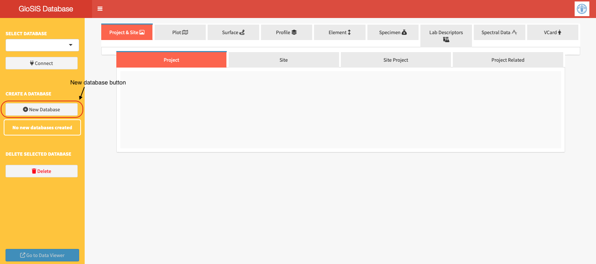
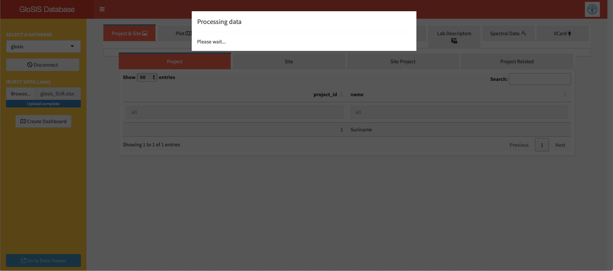
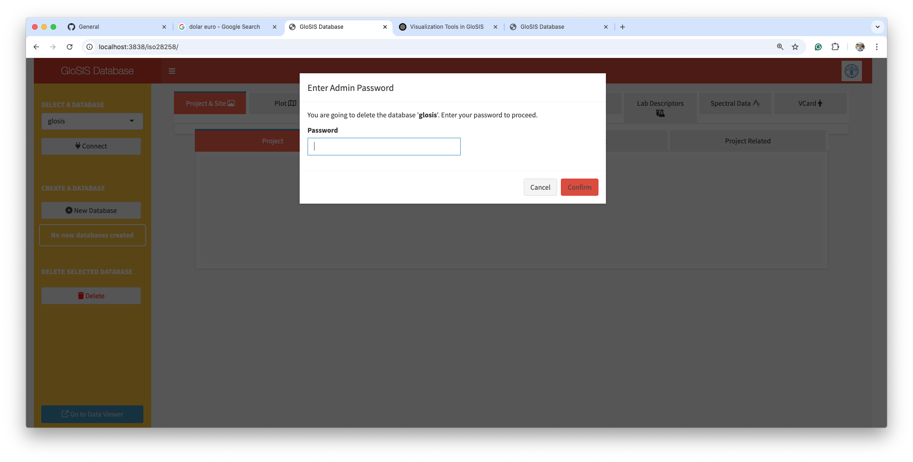

# **Data injection into the GloSIS database**

## Create a new database.

Open the `glosis-shiny` application in your web browser at `http://localhost:3838/iso28258/`. This site will display the main window of the application.

The window contains a dropdown menu listing all existing databases in the system (empty if running for the first time), a button to connect to the selected database, a button to create a new database, and a Remove button to delete an existing database.

The first step is to create a new database to store the soil data. The `New Database` button is intended for this task (Figure \@ref(fig:newdb)). When clicked, a dialog window will pop up asking for the database name. Enter a name in the field and click the `Confirm` button. A message will appear indicating that the database has been successfully created. In case the database already exists, the message will also indicates it. The new database will be stored in the `data` folder within the working directory and will become active in the `Select Database` dropdown menu.

The first step is to create a new database to store the soil data using the `New Database` button (Figure @ref(fig:newdb)). A dialog window will pop up asking for the database name. Enter a name in the field and click the `Confirm` button. A message will appear indicating that the database has been successfully created. If the database already exists, the message will indicate this as well.

The new database will be stored in the `data` folder within the working directory and will become available in the `Select Database` dropdown menu.

```{r newdb, echo=FALSE, out.width="100%",fig.cap = "Creation of a new database."}

```

## Data injection.

Select the database to be filled in the `Select Database` dropdown menu and click on the `Connect` button. At this point, the main body of the application will show the column names for each table but the registers are still empty. If the database has previous data, the tables will show the already inserted data. A new section `ÌNJECT DATA (.xlsx)` will appear in the sidebar. This includes a `Browse` button to select the `.xlsx` data to insert into de database. Click on this button to select the `.xlsx` file to use and click on the `use`button. The file will be uploaded and injected into the database. A message indicating that the data is being processed for its inclusion in the database will appear (Figure \@ref(fig:processing)).


Select the database to be filled from the `Select Database` dropdown menu and click on the `Connect` button. At this point, the main body of the application will display the column names for each table, but the records will still be empty. If the database already contains data, the tables will show the previously inserted records.

A new section, `INJECT DATA (.xlsx)`, will appear in the sidebar. This section includes a `Browse` button to select the `.xlsx` file containing the data to be inserted into the database. Click this button to choose the `.xlsx` file, then click the `Use` button. The file will be uploaded and injected into the database.

A message will appear indicating that the data is being processed for inclusion in the database (Figure @ref(fig:processing)).

```{r processing, echo=FALSE, out.width="100%",fig.cap = "Message indicating data is being processed for injection into the database."}

```

Once the process is complete, the database will display the data for each table. The database can be accessed from other applications and updated with new record using the same `glosis-shiny` application.

## Delete an existing database.

In this application, databases can also be deleted. The deletion of databases has to be taken with caution and under a security confirmation such a password. For educational porposes, the password has been left black by default but it can be changes for development purposes. 
The `Delete` button is only available when disconnected from databases. To delete a button, select de database to cancel in the `SELECT DATABASE` dropdown menu and click on the `Delete` button. After confirmation (Figure \@ref(fig:deletedb)), the database will be removed completely. 


```{r deletedb, echo=FALSE, out.width="100%",fig.cap = "Deletion of a database."}

```


