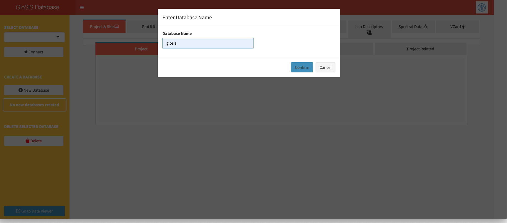
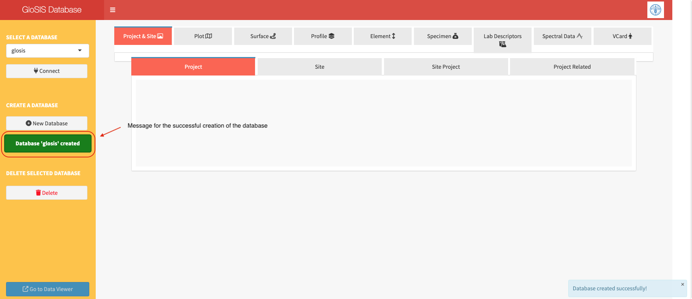
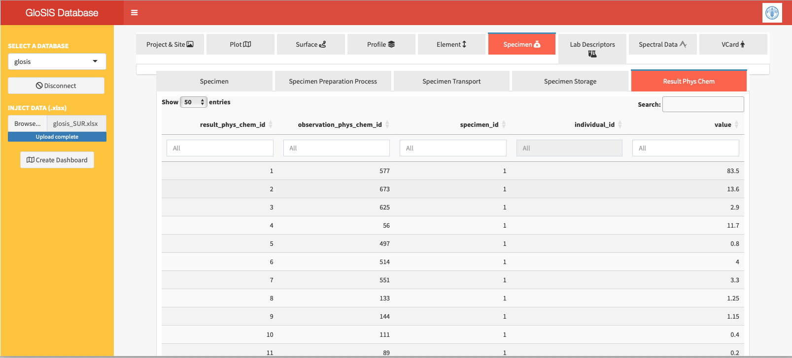

# **Data injection into the GloSIS database**

## Create a new database

Open the `glosis-shiny` application in your web browser at `http://localhost:3838/iso28258/`. This site will display the main window of the application.

The window contains a `SELECT DATABASE` dropdown menu listing all existing databases in the system (empty if running for the first time), a `Connect` button to connect to the selected database, a `New Database` button to create a new database, and a `Remove` button to delete an existing database.


The first step is to create a new database to store the soil data using the `New Database` button (Figure \@ref(fig:newdb)).

```{r newdb, echo=FALSE, out.width="100%",fig.cap = "Creation of a new database."}

```

A dialog window will pop up asking for the database name (Figure \@ref(fig:dbname)). Enter a name in the field and click the `Confirm` button. A message will appear asking for and administrative password. Leave this option empty and click `Confirm`. 

```{r dbname, echo=FALSE, out.width="100%",fig.cap = "Name the database."}

```

A new message in green will appear in the sidebar, indicating that the database has been successfully created (Figure \@ref(fig:dbcreated)). If the database already exists, the message will indicate this as well.

```{r dbcreated, echo=FALSE, out.width="100%",fig.cap = "Name the database."}

```
 
The new database will be stored in the `data` folder within the working directory and will become available in the `SELECT DATABASE` dropdown menu.

## Data injection

Select the database to be filled from the `SELECT DATABASE` dropdown menu and click on the `Connect` button. At this point, the main body of the application will display the column names for each table, but the records will still be empty. If the database already contains data, the tables will show the previously inserted records.

A new section, `INJECT DATA (.xlsx)`, will appear in the sidebar. This section includes a `Browse` button to select the `.xlsx` file containing the data to be inserted into the database. Click this button to choose the `.xlsx` file, then click the `Use` button. The file will be uploaded and injected into the database.

A message will appear indicating that the data is being processed for inclusion in the database (Figure \@ref(fig:processing)).

```{r processing, echo=FALSE, out.width="100%",fig.cap = "Message indicating data is being processed for injection into the database."}
knitr::include_graphics("figures/processing.png")
```

Once the process is complete, the database will display the data for each table (Figure \@ref(fig:injected)). 

```{r injected, echo=FALSE, out.width="100%",fig.cap = "GloSIS database populated showing the records for the table of physic and chemical analytical results."}

```

The database can be now accessed from other applications and updated with new record using the same `glosis-shiny` application.

## Delete an existing database

Databases can also be deleted using this application. However, database deletion should be performed with caution and requires security confirmation, such as a password. For educational purposes, the password is left blank by default, but it can be changed for development purposes.

The `Delete` button is only available when disconnected from databases. To delete a database, select the database to remove from the `SELECT DATABASE` menu and click the `Delete` button. After confirmation (Figure \@ref(fig:deletedb)), the database will be permanently removed.


```{r deletedb, echo=FALSE, out.width="100%",fig.cap = "Deletion of a database."}

```


