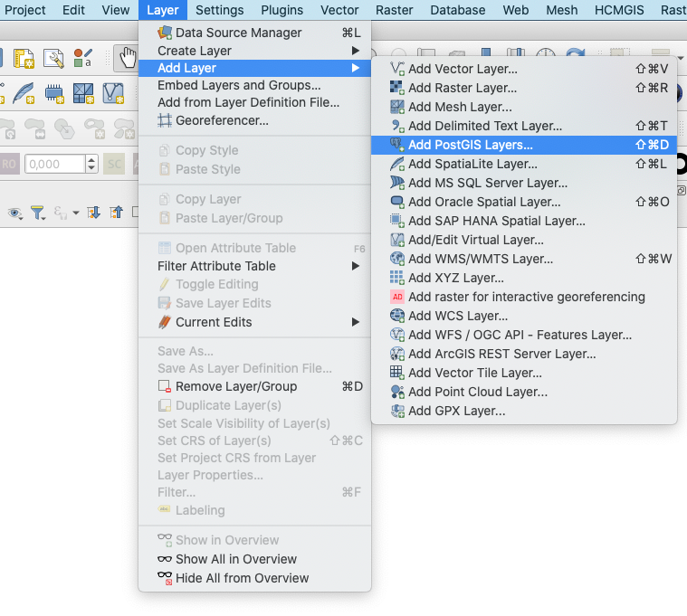
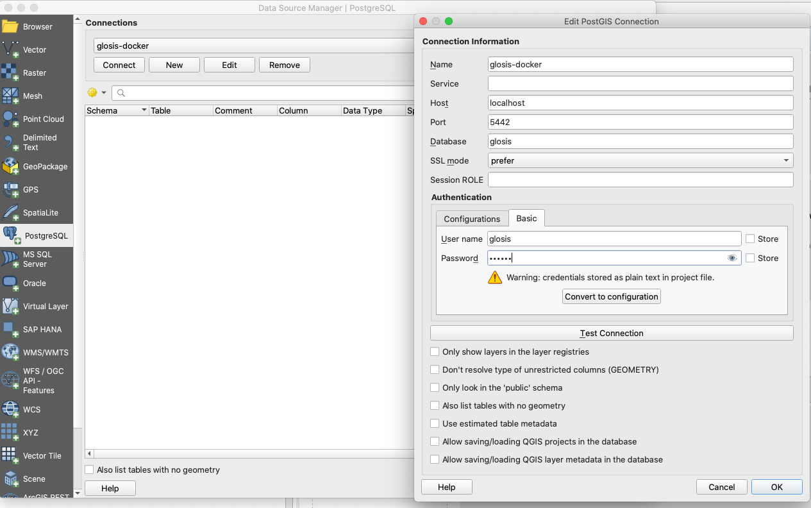
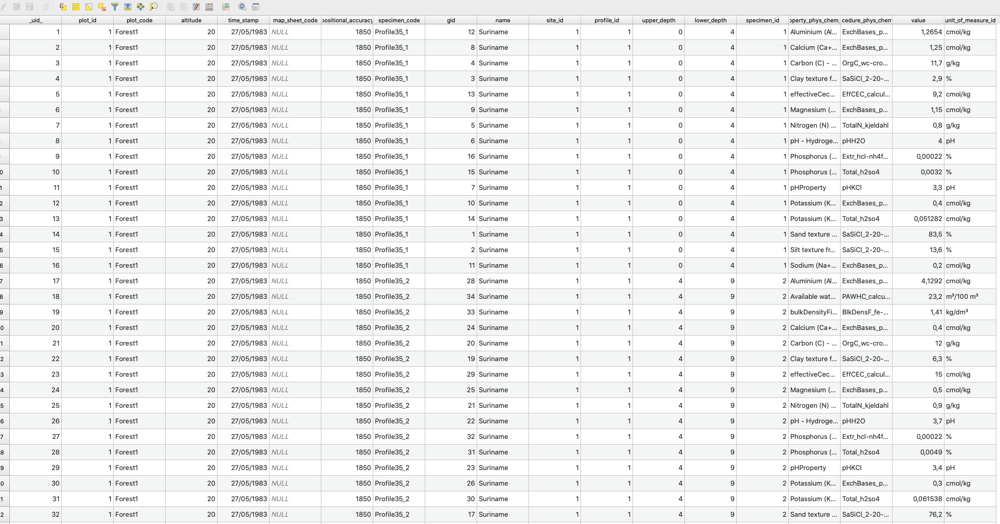

# **Visualization**

Two visualization tools are included in this app: a `Dashboard` viewer and a `Data Viewer` application in Shiny. Both are designed to display data from the GloSIS database in a user-friendly format, and the `Data Viewer` also allows the export of soil data points to `.csv`, `.xlsx`, and the clipboard.

## View Data on the Dashboard

The first visualization tool is a dashboard generated in `.html` format. This dashboard is useful for verifying whether the data has been correctly updated in the database, identifying potential errors in positioning, and detecting data outliers. The file contains all selected data from the GloSIS database, which may result in a large file size depending on the number of records.

A `Create Dashboard` button appears after populating the GloSIS database with soil data (Figure \@ref(fig:dashboardcreate)).

```{r dashboardcreate, echo=FALSE, out.width="60%", fig.cap = "`Create Dashboard button` on the left panel of the data injection app."}
knitr::include_graphics("figures/dashboard_create.png")
```

Clicking this button generates a `.html` file stored in the `init-scripts` folder within the working directory, using the same name as the database. The application then renders the file, and a new button,`Go to Dashboard`, will appear (Figure \@ref(fig:dashboardgoto)).

```{r dashboardgoto, echo=FALSE, out.width="60%", fig.cap = "`Go to Dashboard` button in <span style='color:green;'>green</span> color."}
knitr::include_graphics("figures/dashboard_goto.png")
```

Clicking this button opens a `.html`format file in a new tab displaying soil data in three sections (Figure \@ref(fig:dashboard1)):

-   **Location** -- Contains details about the position of the soil data points.\
-   **Attributes** -- Data on soil properties.\
-   **Boxplot** -- Data with value bars showing the distribution of soil properties across profiles and depths for quick visual comparisons.

```{r dashboard1, echo=FALSE, out.width="60%",fig.cap = "Visualization of the soil data in the dashboard.."}
knitr::include_graphics("figures/dashboard1.png")
```

Tables and the map are internally linked, allowing users to select specific soils either on the map or in the tables, with their location and attributes automatically filtered. The `Make a selection` button on the map can be used for this task when selecting directly from the map (Figure \@ref(fig:dashboard4)).

```{r dashboard4, echo=FALSE, out.width="60%",fig.cap = "Boxplot visualization of filtered soil data attributes."}
knitr::include_graphics("figures/dashboard4.png")
```


## View data on the Data Viewer App

The second visualization tool is accessible via the `Go to Data Viewer` button (Figure \@ref(fig:viewer)) at the bottom of the `glosis-shiny` app. Clicking this button opens a new tab (Figure \@ref(fig:viewer)) with a dropdown menu listing available databases. These databases are those previously created within the `glosis-shiny` app. The button `Go to GloSIS database` brings you back to the `glosis-shiny` app for data injection.


```{r viewer, echo=FALSE, out.width="60%",fig.cap = "Visualization app."}
knitr::include_graphics("figures/viewer.png")
```


After selecting a database, clicking `Connect` displays the soil data both in a tabular format and as a map showing the locations of soil samples (Figure \@ref(fig:viewer2)). 
```{r viewer2, echo=FALSE, out.width="60%",fig.cap = "Visualization app showing soil data from the selected database."}
knitr::include_graphics("figures/viewer2.png")
```

Similar to the dashboard, this tool is designed primarily for data verification and correction. In this app, soil data can be exported to other file formats.

## View data on the QGIS

Alternatively, the database can be accessible from your computer opening a PostgreSQL connection from QGIS using the following credentials:

```bash
Host: "localhost"
Port: "5442"
User name: "glosis"
Password: "glosis"
```

To connect from QGIS:

- Open QGIS
- Add a PostGIS layer ((Figure \@ref(fig:qgis1)).  

```{r qgis1, echo=FALSE, out.width="40%",fig.cap = "Adding a PostGIS layer in QGIS."}

```

- In **Connections** add a `New` connection and fill in the connection details (Figure \@ref(fig:qgis2)):
  - Name the connection (in this example `glosis-docker`).
  - Set the Host name to `locaohost`.
  - Add the Port details (`5442`)
  - Add the database name to connect to (in this example `glosis`). Change it to your database name if a different name has been used.
  - In **Authentication** move to the **Basic** `tab` and enter the default User name (`glosis`) and password  (`glosis`).
  - Click on **Test the connection** to check if the database is accessible.
  - Click on **OK**.
  - Finally, in **Connections**, click on **Connect**. The system may prompt you again for the default username and password (`glosis`).

```{r qgis2, echo=FALSE, out.width="60%",fig.cap = "Connect to an existing database from QGIS."}

```

Once the database has been connected, the geographic features of the database will appear under the core dropdown menu. Select `plot`, click on `Add` and the connected database will appear in your layers.

At this point, the sampling points contain only the information from the `Plot Data` sheet in the template. To add values for soil properties, the geographic elements of this table must be linked to the `property_phys_chem` table, which records such values. This can be done with an `SQL` query in QGIS.

- 1. Go to `DB Manager` in the `Database` main menu.
- 2. Select `PostGIS` in the `Providers` menu in the left panel and double-click on your the database connection.
- 3. Click on the `SQL Window` button (the second button on the top left).
- 4. Paste the following `SQL` query, click on the `Execute` button, and then click `Load`. Ensure that the `Load as a new layer` option is selected:

```bash
SELECT 
    p2.plot_id,
    p2.plot_code,
    p2.altitude,
    p2.time_stamp,
    p2.map_sheet_code,
    p2.positional_accuracy,
    p2."position" AS geom,
    s2.code AS specimen_code,
    r.result_phys_chem_id AS gid,
    p.name,
    s.site_id,
    p3.profile_id, 
    e.upper_depth,
    e.lower_depth,
    r.specimen_id,
    o.property_phys_chem_id,
    o.procedure_phys_chem_id,
    r.value,
    o.unit_of_measure_id
FROM core.project p
LEFT JOIN core.site_project sp ON sp.project_id = p.project_id
LEFT JOIN core.site s ON s.site_id = sp.site_id
LEFT JOIN core.plot p2 ON p2.site_id = s.site_id
LEFT JOIN core.profile p3 ON p3.plot_id = p2.plot_id
LEFT JOIN core."element" e ON e.profile_id = p3.profile_id
LEFT JOIN core.specimen s2 ON s2.element_id = e.element_id
LEFT JOIN core.result_phys_chem r ON r.specimen_id = s2.specimen_id
LEFT JOIN core.observation_phys_chem o ON o.observation_phys_chem_id = r.observation_phys_chem_id 
ORDER BY p2.plot_id, p.name, s.site_id, p3.profile_id, e.upper_depth, o.property_phys_chem_id;

```


You will see the resulting layer with the soil attribute table (Figure \@ref(fig:qgis3)) in your QGIS view. Additional attributes can be added to the table using specific `SQL` queries.

```{r qgis3, echo=FALSE, out.width="60%",fig.cap = " QGIS Table with soil data."}

```

