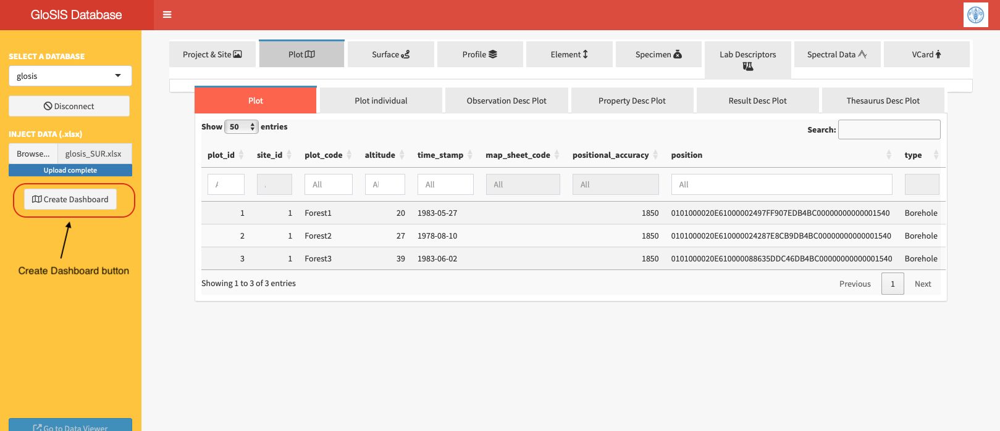
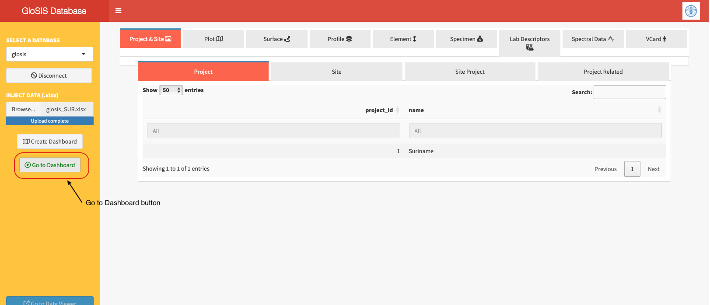
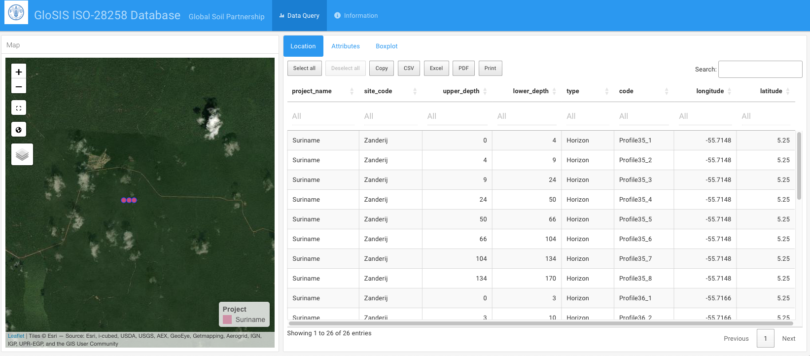
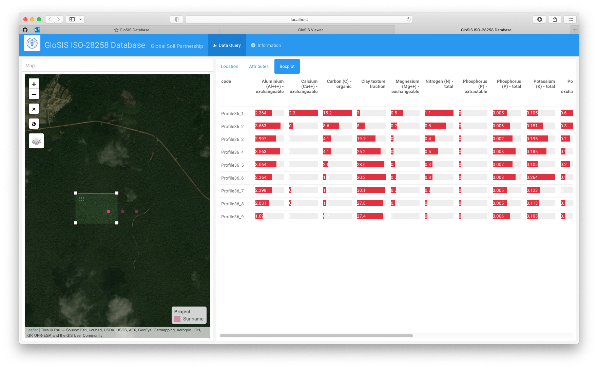
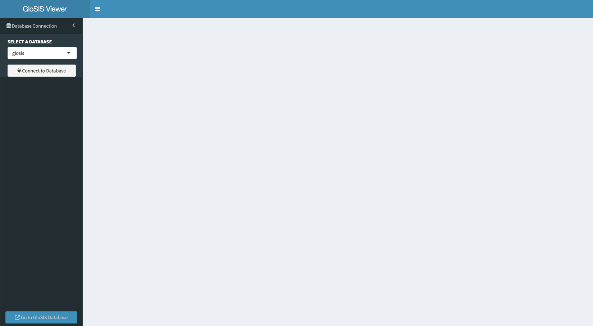
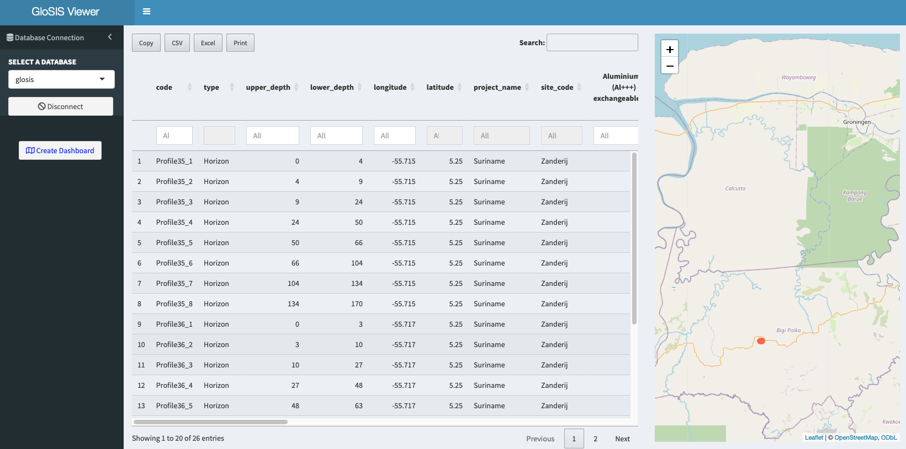

# **Visualization**

Two visualization tools are included in this app: a `Dashboard` viewer and a `Data Viewer` application in Shiny. Both are designed to display data from the GloSIS database in a user-friendly format, and the `Data Viewer` also allows the export of soil data points to `.csv`, `.xlsx`, and the clipboard.

## View Data on the Dashboard

The first visualization tool is a dashboard generated in `.html` format. This dashboard is useful for verifying whether the data has been correctly updated in the database, identifying potential errors in positioning, and detecting data outliers. The file contains all selected data from the GloSIS database, which may result in a large file size depending on the number of records.

A `Create Dashboard` button appears after populating the GloSIS database with soil data (Figure \@ref(fig:dashboardcreate)).

```{r dashboardcreate, echo=FALSE, out.width="60%", fig.cap = "`Create Dashboard button` on the left panel of the data injection app."}

```

Clicking this button generates a `.html` file stored in the `init-scripts` folder within the working directory, using the same name as the database. The application then renders the file, and a new button,`Go to Dashboard`, will appear (Figure \@ref(fig:dashboardgoto)).

```{r dashboardgoto, echo=FALSE, out.width="60%", fig.cap = "`Go to Dashboard` button in <span style='color:green;'>green</span> color."}

```

Clicking this button opens a `.html`format file in a new tab displaying soil data in three sections (Figure \@ref(fig:dashboard1)):

-   **Location** -- Contains details about the position of the soil data points.\
-   **Attributes** -- Data on soil properties.\
-   **Boxplot** -- Data with value bars showing the distribution of soil properties across profiles and depths for quick visual comparisons.

```{r dashboard1, echo=FALSE, out.width="60%",fig.cap = "Visualization of the soil data in the dashboard.."}

```

Tables and the map are internally linked, allowing users to select specific soils either on the map or in the tables, with their location and attributes automatically filtered. The `Make a selection` button on the map can be used for this task when selecting directly from the map (Figure \@ref(fig:dashboard4)).

```{r dashboard4, echo=FALSE, out.width="60%",fig.cap = "Boxplot visualization of filtered soil data attributes."}

```


## View data on the Data Viewer App

The second visualization tool is accessible via the `Go to Data Viewer` button (Figure \@ref(fig:viewer)) at the bottom of the `glosis-shiny` app. Clicking this button opens a new tab (Figure \@ref(fig:viewer)) with a dropdown menu listing available databases. These databases are those previously created within the `glosis-shiny` app. The button `Go to GloSIS database` brings you back to the `glosis-shiny` app for data injection.


```{r viewer, echo=FALSE, out.width="60%",fig.cap = "Visualization app."}

```


After selecting a database, clicking `Connect` displays the soil data both in a tabular format and as a map showing the locations of soil samples (Figure \@ref(fig:viewer2)). 
```{r viewer2, echo=FALSE, out.width="60%",fig.cap = "Visualization app showing soil data from the selected database."}

```

Similar to the dashboard, this tool is designed primarily for data verification and correction. In this app, soil data can be exported to other file formats.


